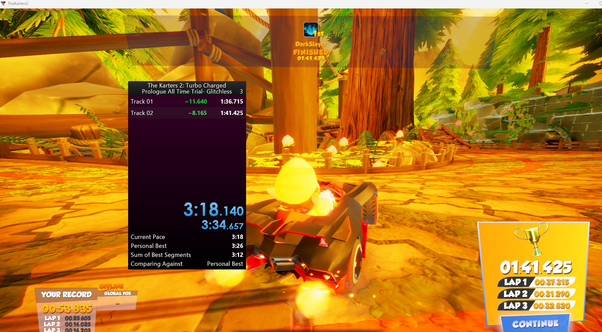

# The Karters 2: Turbo Charged - LiveSplit AutoSplitter

An advanced, high-precision AutoSplitter script for **The Karters 2: Turbo Charged**. This script hooks into the game's IL2CPP memory layer to sync LiveSplit cleanly with internal engine data, utilizing highly optimized state caching for zero-overhead performance.

## Features

* **Automatic Start:** The timer fires the exact frame the pre-race countdown ends and the race officially begins.
* **Stitched Master IGT Tracking:** Automatically accumulates individual map times into a unified running total. This fixes broken split segments and calculates total Cup In-Game Time (IGT) flawlessly.
* **Restart-Resilient Accumulation:** Seamlessly handles mid-race retries and manual track restarts. If you restart a track midway through a run, the elapsed time of your aborted attempt is instantly locked and appended to the master total rather than being lost.
* **Absolute Mathematical Precision:** Utilizes a 64-bit double-precision accumulator to guarantee zero floating-point rounding drift, even across massive multi-hour runs.
* **Zero-Overhead State Caching:** Evaluates memory transitions exactly once per engine tick, acting as a single source of truth to ensure the script never wastes CPU cycles or misfires logic.
* **Clean Pausing:** Retains complete layout pausing during game menus, loading sequences, and pre-race countdown states without triggering false splits.

## Configuration Requirements

1. Open LiveSplit, right-click the layout, and select **Edit Splits...**
2. Ensure your Game Name is set precisely to: `The Karters 2: Turbo Charged` and click **Activate**.
3. **Crucial Step:** Right-click LiveSplit, hover over **Compare Against**, and select **Game Time**. Because this script overrides the standard timer with direct memory-injected ticks to prevent frame-drift, it will not display accurately if left on *Real Time*.